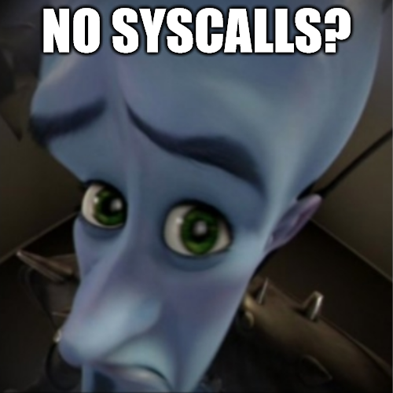

# Confinement

Author: `nhwn`



## Solution

We're allowed to execute a shellcode payload with no byte constraints, but only the `exit_group` syscall (which is what returning from `main` does) is permitted because of this seccomp filter:

```c
scmp_filter_ctx ctx = seccomp_init(SCMP_ACT_KILL);
seccomp_rule_add(ctx, SCMP_ACT_ALLOW, SCMP_SYS(exit_group), 0);
seccomp_load(ctx);
```

As a result, we can't use the `write` syscall to print the flag to stdout and call it a day. However, we _do_ get some form of feedback through the exit code of our shellcode process:

```c
wait(&ret);
if (ret != 0) {
    puts("something went wrong D:");
} else {
    puts("adios");
}
```

Since the flag doesn't change between executions, we can apply intelligent brute force and exfiltrate the result of a boolean query with each execution (much like blind SQLi).

Before we can access the bytes of the flag, we need to break PIE because the flag is stored in a global variable. To do this, we can leak the return address into `main` from `rsp`. Then, it's just a matter of doing arithmetic with offsets to compute the address of `FLAG`. To actually influence the value of the exit code, we can simply return back to `main` in the truthy case and crash in the falsey case (you could also set `rax` before returning). Here's the shellcode:

```py
flag = elf.sym["FLAG"]
shift = flag - main_ret
s = asm(f"""
mov rax, [rsp]
add rax, {shift}
cmp BYTE PTR [rax + {index}], {imm}
jbe kaboom
ret
kaboom:
""")
```

To minimize the number of queries we need to make, we can use binary search. The full details can be found in `solve.py`.

Flag: `gigem{3xf1l_5ucc3ss!}`
